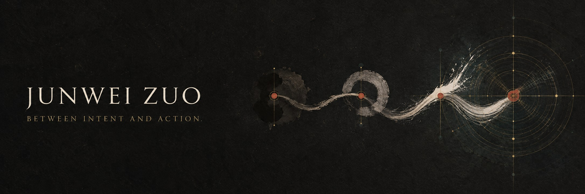

  

  <strong>English</strong> · <a href="./README.zh-CN.md">中文</a>

**AI FDE · Agent Systems Architect**

> I am not trying to make machines resemble us.  
> I am interested in how human intent becomes reliable machine action.

My work sits where three boundaries meet: business determines why we begin, product defines what arrival means, and engineering decides whether the path exists at all.

Many AI initiatives begin with an answer too early—an agent, a workflow, a model integration. I tend to begin before the answer: reframing the problem, deciding what deserves automation, and defining the conditions under which an outcome is correct. Then I continue after it: shaping context, granting capability, drawing boundaries, and remaining skeptical of the system's results.

It is the work of moving from ambiguity to clarity, and from clarity into reality.

---

### The distance between intent and action

An agent is not made real by how human it sounds. It is made real by three questions.

**What does it know?**  
Context is not the sum of all available information. It is a judgment about what matters now.

**What is it allowed to do?**  
Every capability is also a permission. The more tools a system receives, the more deliberately its boundaries must be designed.

**Why should we believe it is right?**  
Intelligence without evaluation is only an impression. Evals are not the final gate of a product; they are part of its definition.

Context, capability, and evaluation determine whether a model call can become a system.

---

### Question · Know · Prompt · Do

**Question** is the calibration of desire.  
**Know** is the recognition of reality.  
**Prompt** is understanding passing through the narrow gate of language.  
**Do** is a choice submitting itself to the test of the world.

In AI, a prompt is never only an instruction. It is the designed interface between human understanding and machine action.

Question deeply enough to discover what is right. Understand clearly enough to know what the machine must be told. Express precisely enough for action to approach intent.

The beginning and the end both point to what we want. The difference is that the first want is still uncertain; the final action has become a choice.

---

### Current practice

I work in Beijing as an AI FDE and Agent Engineer. I am exploring agents that can operate under real constraints: how they acquire context, use tools, persist through long-horizon work, collaborate with other agents, and recognize the moments when judgment must return to a human.

I remain optimistic about model capability and cautious about system reliability.

[Field Notes](https://www.junweizuo.cn) · [Principles](./notes/principles.en.md) · [Now](./notes/now.en.md) · [Email](mailto:zjw010519@gmail.com)

 

  QUESTION WHAT YOU WANT · KNOW WHAT IS RIGHT · PROMPT WHAT YOU LEARN · DO WHAT YOU WANT

